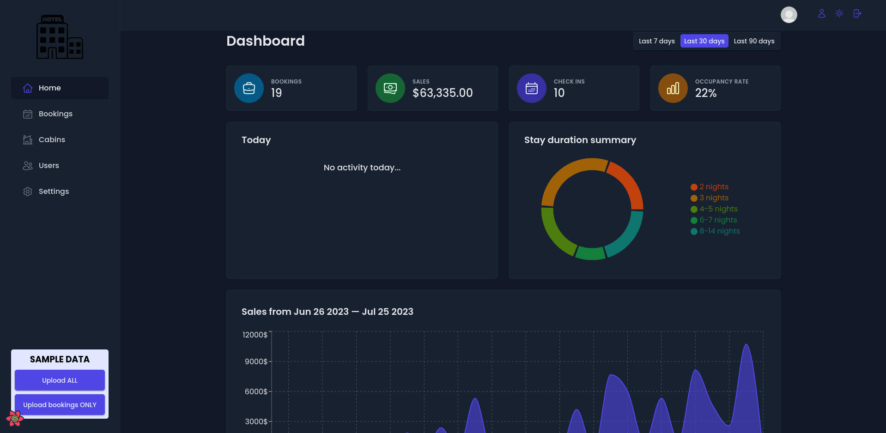
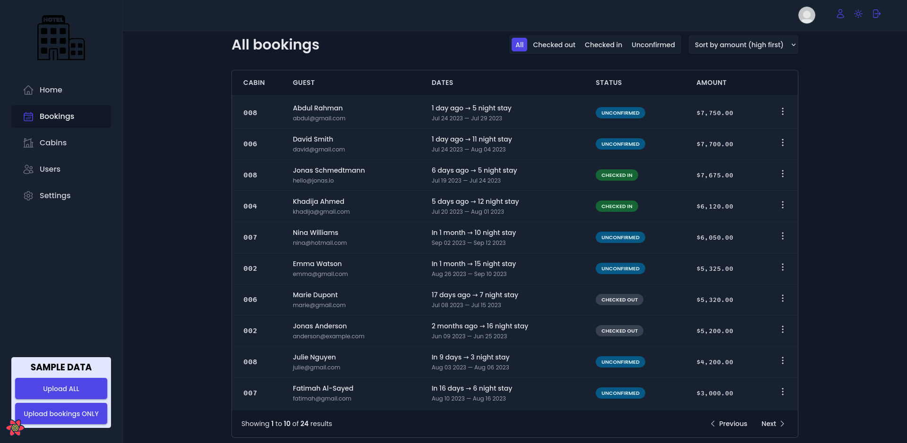

# Hotel Manager

This is a react application to assist manage the bookings and guests in a hotel.




Routing is performed with ReactRouter; styling is done with styled components; remote state is managed with React Query; UI state is managed with Context API; offers data persistence with Supabase.

---

## Deployment

Deployed with Render:

https://hotel-manager.onrender.com

---

## Software Requirements Specification

### 1. Introduction

#### 1.1 Purpose

This manager was built to better learn and practice the React framework; and although it was not built with the expectation that it would be used by any institution, it certainly could find use in the hands of small businesses. 

#### 1.2 Scope

This application is not intended to compete with established business managers. It could, however, be a free alternative that will be of use to hotels that don't have a need for the countless features offered by the more well established alternatives. 

#### 1.3 Definitions

- User: hotel employee;

### 2. Overall Description

#### 2.1 User Stories

As a starting point to the development, business requirements were gathered. These requirements are shown below:

- 

#### 2.2 Constraints, Assumptions and Dependencies


### 3. Requirements and Features

#### 3.1 Functional Requirements

- 

#### 3.2 Nonfunctional Requirements

- 

---

## Features

- 

---

## Sample Data

The sample users are:

```
email: user@example.com
password: 123456
```
